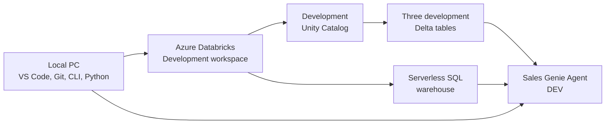

# Enterprise Guide: End-to-End Testing of a Genie Agent from a Local PC

## 1. Purpose

This document explains how a team can develop and test a Genie Agent when:

- Development begins on a local PC.
- The business data is available in three tables.
- The team wants an end-to-end test before promotion to test or production.
- Agent configuration, test cases, scripts, and deployment assets must be maintained in source control.

It also explains the business and semantic concepts needed to configure the agent correctly, including measures, dimensions, KPIs, relationships, business definitions, synonyms, example SQL, common questions, general instructions, and data-quality limitations.

The example domain used throughout this guide is sales, with the following tables:

```text
genie_dev.sales.orders
genie_dev.sales.customers
genie_dev.sales.products
```

---

## 2. Executive Answer: Can a Genie Agent Run Entirely on a Local PC?

No. A real Genie Agent cannot be hosted and executed entirely on a local PC.

The local PC can be used to:

- Develop and version the Genie Agent configuration.
- Use VS Code, Git, Python, the Databricks CLI, and API-testing tools.
- Store configuration JSON, test questions, benchmark definitions, scripts, and documentation.
- Invoke and test a remotely hosted development Genie Agent.
- Run a local user interface that calls the remote Genie Agent API.
- Automate validation and deployment operations.

The following components must run in Azure Databricks:

- The Genie Agent service.
- The three queryable data sources registered in Unity Catalog.
- A Pro or Serverless SQL warehouse.
- Natural-language interpretation and SQL generation.
- SQL execution and governed data access.
- Native result tables and visualizations.

Therefore, the correct interpretation of “test from my local PC” is:

> Develop, initiate, automate, and inspect tests from the local PC while the development Genie Agent, Unity Catalog data, and SQL warehouse run in an Azure Databricks development workspace.

Azure Databricks officially requires Genie Agent data to be registered in Unity Catalog and requires a Pro or Serverless SQL warehouse. See [Create and manage a Genie Agent](https://learn.microsoft.com/en-us/azure/databricks/genie-agents/set-up).

If no Azure Databricks workspace is available, the team can prepare configurations, test cases, mock responses, and deployment code, but it cannot complete a genuine end-to-end Genie Agent test.

---

## 3. Current Product Terminology

The current product name is **Genie Agent**. It was formerly called **Genie Space**.

Some technical interfaces retain the earlier terminology for compatibility. For example, the CLI or serialized configuration may still use terms such as:

```text
space_id
get-space
create-space
update-space
serialized_space
```

These names do not mean that a different product is being used. They refer to the current Genie Agent through compatibility-oriented CLI or API fields.

---

## 4. Recommended Enterprise Test Architecture



### 4.1 Responsibilities by location

| Component | Recommended location | Purpose |
|---|---|---|
| VS Code | Local PC | Edit configuration, SQL, Python, tests, and documentation |
| Git repository | Local PC and GitHub | Version control and team collaboration |
| Databricks CLI | Local PC | Authenticate and manage workspace assets |
| API test scripts | Local PC/GitHub | Invoke the remote development Genie Agent |
| Genie configuration JSON | Local PC/GitHub | Version-controlled agent configuration |
| Test questions and expected results | Local PC/GitHub | Repeatable validation and regression testing |
| Three business tables | Unity Catalog | Governed data queried by Genie |
| SQL warehouse | Azure Databricks | Execute generated SQL |
| Genie Agent | Azure Databricks | Interpret questions, generate SQL, and return answers |
| Optional custom UI | Local PC during development | Test a custom user experience against the remote agent |

---

## 5. Development Environment and Naming

The first implementation should be isolated from production.

Recommended objects:

```text
Catalog: genie_dev
Schema:  sales
Agent:   Sales Genie Agent - DEV
```

Example table names:

```text
genie_dev.sales.orders
genie_dev.sales.customers
genie_dev.sales.products
```

Do not connect an experimental agent directly to production data unless the data owners, security team, and platform team have explicitly approved it.

For sensitive data, use one of the following:

- Masked development data.
- De-identified representative data.
- Synthetic data with realistic distributions.
- A governed development subset of production data.

The sample must still preserve realistic joins, dates, categories, null patterns, and business scenarios. An unrealistically clean sample can make an agent appear more accurate than it will be in production.

---

## 6. Local-PC Prerequisites

Install the following on the local PC:

- VS Code or another preferred editor.
- Git.
- Python.
- Databricks CLI.
- `jq` when using shell-based JSON export/import examples.
- An API client such as `curl`, Postman, or a Python HTTP client.

Authenticate the local PC to the development workspace:

```bash
databricks auth login \
  --host https://<your-azure-databricks-workspace-url>
```

Verify authentication:

```bash
databricks current-user me
```

Authentication does not make the Genie Agent local. It allows local development tools to communicate securely with the Databricks workspace.

---

## 7. Preparing and Keeping the Three Tables

### 7.1 Required location

For a real Genie Agent test, all three sources must be registered in Unity Catalog. The agent cannot query local CSV, SQLite, Pandas, or Parquet data directly from the developer's PC.

If the source data currently exists only on the local PC:

1. Upload it to a governed development location, such as a Unity Catalog volume.
2. Validate the data and schema.
3. Create Unity Catalog managed Delta tables.
4. Attach those tables to the development Genie Agent.

### 7.2 Example table creation

```sql
CREATE CATALOG IF NOT EXISTS genie_dev;
CREATE SCHEMA IF NOT EXISTS genie_dev.sales;

CREATE TABLE genie_dev.sales.orders
USING DELTA
AS
SELECT *
FROM parquet.`/Volumes/genie_dev/sales/source/orders`;

CREATE TABLE genie_dev.sales.customers
USING DELTA
AS
SELECT *
FROM parquet.`/Volumes/genie_dev/sales/source/customers`;

CREATE TABLE genie_dev.sales.products
USING DELTA
AS
SELECT *
FROM parquet.`/Volumes/genie_dev/sales/source/products`;
```

Adapt the creation logic to the actual source format and schema. Production-quality ingestion should explicitly define types rather than relying blindly on inference.

### 7.3 Recommended example table grains

#### Orders

```text
One row per order line
```

Possible columns:

```text
order_id
order_line_id
order_date
customer_id
product_id
quantity
unit_price
discount_amount
net_sales_amount
order_status
```

#### Customers

```text
One row per customer
```

Possible columns:

```text
customer_id
customer_name
customer_segment
city
state
region
country
customer_status
```

#### Products

```text
One row per product
```

Possible columns:

```text
product_id
product_name
brand
product_category
product_subcategory
unit_cost
product_status
```

### 7.4 Metadata to prepare for each table

Document:

- Business purpose.
- Row-level grain.
- Primary or natural identifier.
- Foreign keys and relationships.
- Relevant date fields.
- Measures and dimensions.
- Refresh frequency and availability time.
- Retention and history behaviour.
- Known data-quality issues.
- Whether inactive or deleted records remain.
- Currency and time-zone conventions.
- Sensitive fields and required masking.

### 7.5 Table and column comments

```sql
COMMENT ON TABLE genie_dev.sales.orders IS
'Contains sales-order line transactions. One row represents one product line within a customer order.';

ALTER TABLE genie_dev.sales.orders
ALTER COLUMN order_date
COMMENT 'Date on which the customer order was placed';

ALTER TABLE genie_dev.sales.orders
ALTER COLUMN net_sales_amount
COMMENT 'Net sales amount after applicable discounts, excluding tax, reported in AUD';
```

Accurate metadata helps the agent interpret business meaning, but comments must not replace governed calculations for complex or critical metrics.

---

## 8. Analytical Foundations: Measures, Dimensions, and KPIs

These concepts must be agreed before configuring business definitions and example SQL.

### 8.1 Measures

A measure is a numeric business value that can be calculated, aggregated, or compared.

Measures answer questions such as:

- How much?
- How many?
- What percentage?
- What is the average?
- What is the minimum or maximum?

Common aggregation functions include:

```sql
SUM()
COUNT()
COUNT(DISTINCT ...)
AVG()
MIN()
MAX()
```

Examples:

| Measure | Meaning | Example calculation |
|---|---|---|
| Net sales | Completed-sales value after applicable discounts | `SUM(net_sales_amount)` |
| Units sold | Total quantity sold | `SUM(quantity)` |
| Order count | Number of unique orders | `COUNT(DISTINCT order_id)` |
| Customer count | Number of purchasing customers | `COUNT(DISTINCT customer_id)` |
| Average order value | Average sales per distinct order | Net sales / order count |
| Average selling price | Sales amount per unit | Net sales / units sold |
| Discount amount | Total discount given | `SUM(discount_amount)` |

Simple measure:

```sql
SUM(o.net_sales_amount) AS net_sales
```

Calculated measure:

```sql
SUM(o.net_sales_amount)
/
NULLIF(COUNT(DISTINCT o.order_id), 0)
AS average_order_value
```

Not every numeric column is a measure. The following are identifiers or labels even when stored as numbers:

```text
customer_id
product_id
postal_code
```

Adding them has no business meaning. Similarly, `unit_price` should not normally be summed; it might require an average or weighted-average calculation.

A complete measure definition should identify:

- Formula.
- Source fields.
- Required filters.
- Treatment of nulls.
- Treatment of cancellations and returns.
- Currency.
- Date basis.
- Permitted aggregation level.

Example complete definition:

> Net sales is the sum of `orders.net_sales_amount` for completed orders. Cancelled and test orders are excluded. Values are reported in AUD using `order_date`.

### 8.2 Dimensions

A dimension is a descriptive attribute used to group, filter, label, or organize measures.

Dimensions answer questions such as:

- By whom?
- By what?
- Where?
- When?
- Which category?
- Which status?

Examples:

| Dimension | Example values |
|---|---|
| Product | Laptop, phone, headphones |
| Product category | Electronics, furniture, clothing |
| Customer | ABC Retail, Smith Stores |
| Customer segment | Consumer, corporate, government |
| Region | NSW, VIC, QLD |
| Order status | Completed, cancelled, pending |
| Sales month | January 2026, February 2026 |
| Brand | Apple, Samsung, Lenovo |

Dimensions commonly appear in `GROUP BY`, `WHERE`, and `ORDER BY` clauses.

```sql
SELECT
    p.product_category,
    SUM(o.net_sales_amount) AS net_sales
FROM genie_dev.sales.orders AS o
JOIN genie_dev.sales.products AS p
    ON o.product_id = p.product_id
WHERE o.order_status = 'Completed'
GROUP BY p.product_category
ORDER BY net_sales DESC;
```

In this query:

- `p.product_category` is a dimension.
- `SUM(o.net_sales_amount)` is a measure.
- `o.order_status` is a dimension used as a filter.

Identifiers such as `order_id`, `customer_id`, and `product_id` are not additive measures. They behave as identifiers or dimensions and may be used in distinct counts.

Dimensions can form hierarchies:

```text
Time:      Year -> Quarter -> Month -> Week -> Date
Product:   Category -> Subcategory -> Brand -> Product
Geography: Country -> State -> Region -> City
```

Most analytical questions follow this pattern:

```text
Measure by Dimension
```

Examples:

```text
Net sales by region
Units sold by product
Order count by month
Average order value by customer segment
```

### 8.3 KPIs

A KPI uses one or more measures to assess performance against an important business objective, target, or threshold.

```text
Measure = What happened?
KPI     = Did we achieve the business objective?
```

Example:

- `Net sales = AUD 1.2 million` is a measure.
- `Net sales achieved 92.31% of the AUD 1.3 million target` is a KPI.

| Aspect | Measure | KPI |
|---|---|---|
| Purpose | Quantifies an activity or result | Evaluates progress toward an objective |
| Business importance | May be informational | Must be strategically important |
| Target required | No | Usually yes |
| Status required | No | Commonly green, amber, or red |
| Time period | Optional | Normally defined |
| Comparison | Not required | Compared with target, threshold, or prior period |

Example thresholds:

| Target achievement | Status |
|---:|---|
| 100% or more | Green |
| 90% to below 100% | Amber |
| Below 90% | Red |

A proper KPI normally contains:

1. Business objective.
2. Actual measure.
3. Target or threshold.
4. Evaluation period.
5. Comparison calculation.
6. Status rules.
7. Business owner.
8. Refresh frequency.

The same calculation can be a measure or a KPI depending on how it is used. An 8% year-over-year sales-growth value is a measure when it merely describes change. It becomes a KPI when evaluated against an approved growth target, such as 10%.

The example three-table model does not contain a target table. A KPI such as sales-target achievement would require a governed source such as:

```text
genie_dev.sales.sales_targets
```

Genie must never invent a target or threshold. If no approved target exists, report the measure without presenting it as target achievement.

For important reusable measures and KPIs, consider governing them in a Unity Catalog metric view rather than repeatedly encoding formulas in free-text instructions or example SQL.

---

## 9. Validate the Data Model Before Creating the Agent

### 9.1 Relationships

| Left table | Left column | Right table | Right column | Relationship |
|---|---|---|---|---|
| `orders` | `customer_id` | `customers` | `customer_id` | Many order lines to one customer |
| `orders` | `product_id` | `products` | `product_id` | Many order lines to one product |

Conceptually:

```text
customers 1 ---- * orders * ---- 1 products
```

### 9.2 Check dimension-key uniqueness

```sql
SELECT customer_id, COUNT(*) AS record_count
FROM genie_dev.sales.customers
GROUP BY customer_id
HAVING COUNT(*) > 1;
```

```sql
SELECT product_id, COUNT(*) AS record_count
FROM genie_dev.sales.products
GROUP BY product_id
HAVING COUNT(*) > 1;
```

### 9.3 Check unmatched records

```sql
SELECT COUNT(*) AS unmatched_customer_order_lines
FROM genie_dev.sales.orders AS o
LEFT JOIN genie_dev.sales.customers AS c
    ON o.customer_id = c.customer_id
WHERE c.customer_id IS NULL;
```

```sql
SELECT COUNT(*) AS unmatched_product_order_lines
FROM genie_dev.sales.orders AS o
LEFT JOIN genie_dev.sales.products AS p
    ON o.product_id = p.product_id
WHERE p.product_id IS NULL;
```

### 9.4 Validate a representative business query

```sql
SELECT
    c.customer_segment,
    p.product_category,
    SUM(o.net_sales_amount) AS net_sales
FROM genie_dev.sales.orders AS o
JOIN genie_dev.sales.customers AS c
    ON o.customer_id = c.customer_id
JOIN genie_dev.sales.products AS p
    ON o.product_id = p.product_id
WHERE o.order_status = 'Completed'
GROUP BY
    c.customer_segment,
    p.product_category;
```

Do not declare a relationship merely because two columns have similar names. Confirm it using source-system documentation, constraints, profiling, business-owner approval, or validated query behaviour.

---

## 10. Create the Development Genie Agent

In the Azure Databricks development workspace:

1. Select **Genie Agents**.
2. Select **New**.
3. Attach the three development tables.
4. Select a development Pro or Serverless SQL warehouse. Serverless is recommended where available.
5. Name the agent clearly, for example `Sales Genie Agent - DEV`.
6. Configure the context described in the following sections.

A Genie Agent uses only the sources explicitly attached to it. Mentioning an unattached table in instructions does not make that table queryable.

---

## 11. Detailed Agent Context Configuration

### 11.1 Agent description

The description states the agent's purpose, domain, audience, supported questions, included data, exclusions, coverage, and refresh timing.

It helps users understand the scope and helps routing systems select the correct agent.

Example:

```markdown
This Genie Agent supports sales analysts and regional sales managers.

It answers questions about sales orders, net sales, customers, products,
product categories, and sales performance over time.

The agent uses order, customer, and product data from the Sales domain.
It does not contain inventory, supplier, employee, payment, return, or
profitability information unless those sources are explicitly added later.

Sales data is refreshed every morning and is normally available through the
end of the previous business day.
```

Avoid vague descriptions such as “This agent answers questions about data.”

### 11.2 Attached-table descriptions

#### Orders

```text
Contains sales-order line transactions. One row represents one product line
within a customer order. Use this table for sales amount, units sold, distinct
order count, customer purchases, and product-sales analysis.
```

Because the grain is one order line, `COUNT(*)` counts lines, not business orders. Use `COUNT(DISTINCT order_id)` for order count.

#### Customers

```text
Contains the current descriptive attributes of each customer. One row
represents one customer. Join it to orders using customer_id for customer,
segment, city, state, and regional analysis.
```

#### Products

```text
Contains the current descriptive attributes of each product. One row
represents one product. Join it to orders using product_id for product, brand,
category, and subcategory analysis.
```

### 11.3 Table relationships

Relationships tell the agent how data should be combined. Encode supported relationships using the product's structured relationship surfaces where available and reinforce non-obvious patterns with validated example SQL.

Required relationships:

```text
orders.customer_id = customers.customer_id
orders.product_id  = products.product_id
```

Document cardinality and whether unmatched records exist. Use left joins when totals must retain transactions with missing dimension records; use inner joins only when excluding unmatched records is explicitly intended.

### 11.4 Business definitions

Business definitions remove ambiguity from terms and calculations.

#### Net sales

```text
Net sales is the sum of orders.net_sales_amount for completed orders.
Cancelled and test orders are excluded. Values are reported in AUD.
```

#### Order count

```text
Order count means the number of distinct order_id values, not the number of
rows in orders, because orders is stored at order-line grain.
```

#### Units sold

```text
Units sold means the sum of orders.quantity for completed sales.
```

#### Average order value

```text
Average order value equals net sales divided by the number of distinct
completed orders.
```

#### Active customer

```text
An active customer is a customer whose customer_status is 'Active'. This does
not necessarily mean that the customer purchased during the selected period.
```

#### Last month

Define it explicitly, for example:

```text
The previous completed calendar month, not the trailing 30 days.
```

Business definitions must be confirmed by the responsible business owner. Do not allow the agent or development team to invent definitions, fiscal calendars, formulas, targets, or exclusions.

### 11.5 Column synonyms

Synonyms connect physical column names with the words users actually use.

| Column | Suggested synonyms |
|---|---|
| `orders.net_sales_amount` | net sales, sales value, revenue |
| `orders.quantity` | units, units sold, sales quantity |
| `orders.order_date` | sales date, transaction date, purchase date |
| `orders.order_id` | order number, sales order |
| `customers.customer_name` | customer, client, account |
| `customers.customer_segment` | segment, customer group |
| `customers.region` | customer region, sales region, territory |
| `products.product_name` | product, item, SKU description |
| `products.product_category` | category, product group |
| `products.brand` | product brand, brand name |

Only add synonyms that represent the same concept. Do not define `profit` as a synonym for `net_sales_amount`. Revenue and profit are different measures.

Avoid blanket synonym configuration for IDs, hashes, ingestion fields, raw text, or technical metadata unless users genuinely refer to them.

### 11.6 Example SQL

Example SQL teaches reliable query shapes, including joins, filters, aggregations, distinct counts, dates, and rankings. Every example must be executed and validated before it is added.

#### Monthly net sales

```sql
SELECT
    DATE_TRUNC('MONTH', o.order_date) AS sales_month,
    SUM(o.net_sales_amount) AS net_sales
FROM genie_dev.sales.orders AS o
WHERE o.order_status = 'Completed'
GROUP BY DATE_TRUNC('MONTH', o.order_date)
ORDER BY sales_month;
```

#### Top ten products by net sales last month

```sql
SELECT
    p.product_id,
    p.product_name,
    SUM(o.net_sales_amount) AS net_sales
FROM genie_dev.sales.orders AS o
JOIN genie_dev.sales.products AS p
    ON o.product_id = p.product_id
WHERE o.order_status = 'Completed'
  AND o.order_date >= ADD_MONTHS(DATE_TRUNC('MONTH', CURRENT_DATE()), -1)
  AND o.order_date < DATE_TRUNC('MONTH', CURRENT_DATE())
GROUP BY
    p.product_id,
    p.product_name
ORDER BY net_sales DESC
LIMIT 10;
```

#### Customer-segment performance

```sql
SELECT
    c.customer_segment,
    SUM(o.net_sales_amount) AS net_sales,
    COUNT(DISTINCT o.order_id) AS order_count
FROM genie_dev.sales.orders AS o
JOIN genie_dev.sales.customers AS c
    ON o.customer_id = c.customer_id
WHERE o.order_status = 'Completed'
GROUP BY c.customer_segment
ORDER BY net_sales DESC;
```

Do not add untested SQL, `SELECT *`, confidential literals, incorrect hard-coded filters, unsupported joins, or duplicated metric logic already governed by a metric view.

### 11.7 Common questions

Common questions are user-facing prompts displayed on the agent's landing page. They demonstrate scope and help users begin.

Examples:

```text
What were total net sales last month?

Show the top 10 products by net sales this quarter.

Compare monthly net sales with the previous year.

Which customer segments generated the most revenue?

Show net sales and units sold by product category.

Which customers placed orders but are currently inactive?

How many distinct orders were completed each week?

Which products had no sales during the previous completed month?
```

Common questions, example SQL, and benchmark questions have different purposes:

| Component | Purpose |
|---|---|
| Common question | Visible suggestion for users |
| Example SQL | Teaches a correct query pattern |
| Benchmark question | Tests whether the agent produces an expected answer |

Avoid vague questions such as “Tell me about the data.” Use questions collected from actual business users.

### 11.8 General instructions

General instructions define agent-wide behaviour that cannot be represented more reliably using structured metadata, relationships, metric views, synonyms, or example SQL.

Example:

```markdown
## PURPOSE

- Answer questions about completed sales orders, customers, and products.
- The intended users are sales analysts and regional sales managers.

## DISAMBIGUATION

- Interpret "last month" as the previous completed calendar month.
- If the user asks for "region" without qualification, use customers.region
  and state that customer region was used.
- If a trend question has no date range, ask the user to provide one rather
  than selecting an arbitrary period.

## CONSTRAINTS

- Do not interpret net sales as profit.
- Do not claim to provide inventory, supplier, payment, employee, or returns data.
- Do not display ingestion timestamps, row hashes, or source filenames.
- Use distinct order_id when calculating order count.

## Instructions you must follow when providing summaries

- State the date range used.
- Round monetary values to two decimal places.
- State the currency when known.
- Mention the exclusion of cancelled orders when reporting net sales.
```

Keep instructions specific, reviewable, and consistent with governed data. Do not use free text as the default location for joins, column definitions, or complex metric formulas.

### 11.9 Data-quality limitations

Data-quality notes disclose unavoidable conditions that could affect answers.

Example:

```markdown
## DATA QUALITY NOTES

- Data is refreshed daily at 06:00 AEST and normally contains transactions
  through the end of the previous business day.
- Orders created today might not appear until the next refresh.
- Some historical orders do not have a matching customer because legacy
  customer records were not migrated.
- Some product_id values do not match the products table. These transactions
  must be reported as "Unknown product" rather than silently removed from totals.
- customers.region contains the customer's current region. Historical orders
  are therefore reported using the current region, not necessarily the region
  assigned when the order occurred.
- net_sales_amount is stored in AUD. Currency conversion is not supported by
  these three tables.
- Cancelled orders remain in orders and must be excluded from completed-sales
  measures.
- Returns are not present. Net sales does not mean sales after returns unless
  return adjustments are already included in net_sales_amount.
```

Correct quality issues upstream where practical. Data-quality notes are not a substitute for repairing data that can be fixed.

For example, retain unmatched product transactions with an explicit label:

```sql
SELECT
    o.order_id,
    o.order_date,
    o.net_sales_amount,
    COALESCE(p.product_name, 'Unknown product') AS product_name
FROM genie_dev.sales.orders AS o
LEFT JOIN genie_dev.sales.products AS p
    ON o.product_id = p.product_id;
```

---

## 12. Testing Inside Azure Databricks First

Native workspace testing should precede local API testing because it makes generated SQL, results, and visualizations easier to inspect.

For every question, verify:

- The correct table or tables were selected.
- Relationships and join types are correct.
- Aggregations match the business definition.
- `COUNT(DISTINCT order_id)` is used for order count.
- Required status and date filters are present.
- The date interpretation is correct.
- Currency and time zone are correct.
- Generated SQL runs successfully.
- Results reconcile to independently validated SQL.
- Natural-language summaries do not overstate the data.
- Visualizations are appropriate.
- Ambiguous questions trigger clarification where required.
- Restricted or unavailable data is not exposed or invented.

---

## 13. Benchmark and Regression Test Design

Create a version-controlled test set containing:

- Business question.
- Expected source tables.
- Expected joins.
- Expected measure and dimensions.
- Required filters.
- Verified SQL or expected result.
- Acceptable wording variations.
- Expected clarification behaviour.
- Test owner and approval status.

Example test cases:

| Test type | Question | Primary validation |
|---|---|---|
| Simple measure | What were total net sales last month? | Correct period, status filter, and sum |
| Grouping | Show net sales by category | Product join and category grouping |
| Distinct count | How many orders were completed? | `COUNT(DISTINCT order_id)` |
| Ranking | Show the top 10 products by sales | Correct ordering and limit |
| Multi-table | Compare sales by segment and category | Both dimension joins |
| Ambiguity | Show sales by region | Defined region or clarification |
| Missing data | Show sales for unmatched products | Unknown-product treatment |
| Unsupported scope | Show profit by product | Agent explains profit is unavailable |
| KPI control | Did we meet the sales target? | No invented target; request/identify target source |

Run the benchmark after every material change to sources, metadata, instructions, synonyms, examples, or metric definitions.

---

## 14. Test the Remote Genie Agent from the Local PC

After the development agent works in the Databricks UI, invoke it from the local PC through the Genie Agent API.

The Agent Mode endpoint is:

```text
POST /api/2.0/genie/agents/{agent_id}/responses
```

Example:

```bash
curl -N \
  -X POST \
  "https://<workspace-host>/api/2.0/genie/agents/<agent-id>/responses" \
  -H "Authorization: Bearer <oauth-token>" \
  -H "Content-Type: application/json" \
  -d '{
    "enable_viz": true,
    "input": [
      {
        "type": "message",
        "role": "user",
        "content": [
          {
            "type": "input_text",
            "text": "Show the top 10 products by net sales last month"
          }
        ]
      }
    ]
  }'
```

The response is streamed using Server-Sent Events. It can include reasoning events, generated SQL function calls, query results, messages, and visualization-related content. See the official [Genie Agent API reference](https://docs.databricks.com/api/genie/v1/agent-mode-create-response).

Do not hard-code personal access tokens or OAuth tokens in source control. Use approved authentication and secret-handling mechanisms.

---

## 15. What Can Be Tested Locally Without a Workspace?

If a Databricks workspace is not yet available, the team can still prepare and test:

- Repository structure.
- Configuration JSON syntax.
- Placeholder catalog, schema, table, warehouse, and agent identifiers.
- Business definitions.
- Table and column metadata.
- Synonym lists.
- Example SQL structure using a compatible test engine where practical.
- Benchmark-question format.
- Mock API responses.
- A local frontend.
- CI/CD workflow syntax.
- Documentation and approval workflows.

However, the following cannot be genuinely validated without a workspace:

- Genie natural-language interpretation.
- Genie SQL generation.
- Genie conversation behaviour.
- Unity Catalog permissions and governance.
- SQL warehouse execution.
- Native result rendering and visualizations.
- Agent monitoring and evaluation.
- End-to-end authentication and authorization.

Local mocks are useful for application development but do not prove Genie accuracy.

---

## 16. Required Permissions

The development team requires, at minimum:

- Databricks SQL workspace entitlement.
- Permission to use the chosen Pro or Serverless SQL warehouse.
- `USE CATALOG` and `USE SCHEMA` where applicable.
- `SELECT` on the attached tables or governed views.
- Appropriate permissions to create or edit the development Genie Agent.
- Permission to query the Genie Agent for local API testing.

End-user data access remains governed through Unity Catalog. Test with representative personas where row filters, column masks, or restricted data apply.

---

## 17. Enterprise Quality and Security Controls

Before declaring the development test successful, confirm:

- The agent has a narrowly defined business domain.
- All attached sources are necessary and approved.
- Table grains and relationships are documented and validated.
- Measures have approved definitions.
- KPIs have approved targets and owners.
- The agent does not invent unavailable measures, KPIs, or targets.
- Sensitive columns are excluded, masked, or otherwise governed.
- Row filters and column masks behave correctly for different users.
- Technical and noisy columns are hidden from the agent where appropriate.
- Example SQL has been executed successfully.
- Benchmarks reconcile to independently verified results.
- Known data limitations are disclosed.
- Unsupported questions receive an honest limitation response.
- Authentication secrets are not committed to Git.
- Development and production assets are separated.
- Changes are reviewed and traceable through version control.

---

## 18. Recommended Configuration and Testing Order

1. Confirm the intended audience and business purpose.
2. Collect real questions from business users.
3. Place representative test data in Unity Catalog.
4. Confirm the grain of each of the three tables.
5. Validate identifiers, uniqueness, and relationships.
6. Identify measures and dimensions.
7. Separate descriptive measures from true KPIs.
8. Obtain approval for formulas, targets, thresholds, dates, currency, and exclusions.
9. Consider a metric view for reusable governed measures and KPIs.
10. Add table and column descriptions.
11. Add precise synonyms.
12. Create and validate representative SQL examples.
13. Create realistic common questions.
14. Add only necessary general instructions.
15. Document unresolved data-quality limitations.
16. Create the development Genie Agent and attach only the approved sources.
17. Test in the Databricks UI.
18. Reconcile results with verified SQL.
19. Run benchmarks and negative tests.
20. Test the remote agent from the local PC through the API.
21. Record defects and refine structured context before expanding free-text instructions.
22. Complete security, permission, and performance checks.
23. Version the approved configuration and tests in GitHub.
24. Promote through controlled CI/CD to test and production environments.

---

## 19. Final Recommended Flow

```text
Local development in VS Code
        |
        v
Git repository with configuration and tests
        |
        v
Azure Databricks development workspace
        |
        +--> Development Unity Catalog
        |       +--> orders
        |       +--> customers
        |       +--> products
        |
        +--> Serverless SQL warehouse
        |
        v
Sales Genie Agent - DEV
        |
        +--> Native UI testing
        +--> Benchmark and reconciliation testing
        +--> Local-PC API testing
        |
        v
Reviewed CI/CD promotion to test and production
```

The key architectural conclusion is:

> The end-to-end test is controlled from the local PC, but the actual Genie Agent, governed tables, and SQL execution remain in Azure Databricks.

---

## 20. Official References

- [Create and manage a Genie Agent — Azure Databricks](https://learn.microsoft.com/en-us/azure/databricks/genie-agents/set-up)
- [Genie Agents overview — Azure Databricks](https://learn.microsoft.com/en-us/azure/databricks/genie-agents/)
- [Genie Agent API: create a response](https://docs.databricks.com/api/genie/v1/agent-mode-create-response)
- [Official Databricks Genie Agent skills repository](https://github.com/databricks/databricks-agent-skills/tree/main/skills/databricks-genie-agents)
- [Create Genie Agent reference](https://github.com/databricks/databricks-agent-skills/blob/main/skills/databricks-genie-agents/references/create-genie-agent.md)
- [Genie Agent CI/CD reference](https://github.com/databricks/databricks-agent-skills/blob/main/skills/databricks-genie-agents/references/genie-agent-cicd.md)
